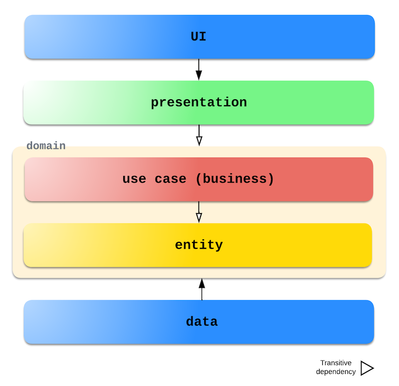
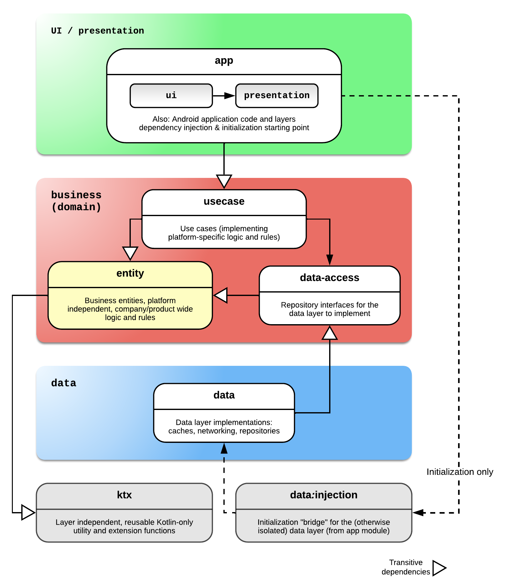

# Clean Architecture on Android: a pragmatic way

The purpose of this repository is to showcase, with a very simple (but hopefully clear) sample
Android project, how I got inspiration from Uncle
Bob's [Clean Architecture](https://8thlight.com/blog/uncle-bob/2012/08/13/the-clean-architecture.html)
to structure the projects I work on.
This is a full, up to date rewrite of
the [sample project](https://github.com/Teamwork/android-clean-architecture) I showcased while
working for Teamwork a good few years ago.

## TL;DR

Template repository to showcase how I structure an Android project following, as closely as
possible, the fundamental requirements of Clean Architecture. I have been using this structure
successfully for years, evolving it with new technologies and Android guidelines.

Compose, navigation and per-layer components (`ViewModel`s, UI states, use cases, repositories,
entities) data loading and presentation techniques are also showcased within the codebase, following
the current Android guidelines along with Clean Architecture best practices.

These are the key aspect of my approach:

- It **bridges the gap** between _Clean Architecture_ and platform-specific Android guidelines.
- It is **scalable** up to very large projects, but it also works well with small/medium-sized ones.
- It enforces **strict layer separation rules**, so that it's hard to make accidental mistakes
  (especially useful for large teams with inexperienced developers).
- It can be used as a **template for other platforms** (e.g. _iOS_ -KMP version coming up-).
- It does require a bit of an initial **learning curve** compared to more basic approaches (but it
  becomes extremely simple once the structural concepts are clear).

**This is not a working demo app**: the only purpose of classes in the project is to demonstrate
how the dependency graphs work with the configuration explained below, and to illustrate which
dependencies are typically involved in this type of architecture. The fact that the project
compiles, as simple as it sounds, is what matters!

Given that broad nature of the topic and the amount of implementation details necessary to implement
a working production project, I have simplified the example as much as possible and focused solely
on the following areas:

- **Module structure:** each architecture layer has its own module(s), following closely the _Clean_
  principles and naming.
- **Separation of layers**: how to configure Gradle making use of `api`/`implementation` to hide
  unwanted dependencies.
- **Dependency Injection:** how to set up *Dagger/Hilt* for a multi-module environment, but still
  ensuring the above points.

### Layer structure and dependencies

There have always been many interpretations and concrete implementations of the guidelines in the
Clean Architecture book from _Uncle Bob_. The many "onion graphs" that one can find online are good
at explaining the general layer structure, a little bit less at outlining the actual dependencies
between concrete layers.
This diagram outlines my high level approach, along with how dependencies are structured.

### Screaming Architecture?

The "_Screaming Architecture_" concept dictates that the architecture of a project should outline
what the system does, rather than how it is implemented. In my sample, features are represented as
"second level" items (_packages_) as opposed to "first level" (_modules_).

This is a compromise I often choose in practice, to avoid overcomplicating the Gradle module
structure. It pays benefits especially on small/medium projects, where granular feature reuse across
products isn't required. With this approach, it's easier to enforce strict boundaries between
layers, while the intent of the system is still extremely clear by just opening a module and looking
at its package structure.

For larger projects and to follow more to the letter the "features as first class components", it's
always possible to use the _feature module_ approach (with nested modules per layer) that I also
showcase in this sample, at a cost of more boilerplate code. Whether to pick one approach or the
other depends on many factors, including simple personal/team preference, and it doesn't impact in
any critical way the tidiness of the structure, nor clashes with Clean Architecture best practices.

See "Vertical Slices Architecture" for a different (yet still compatible) approach on this topic.

## Fundamental approach

There is no such thing as *"the best architecture"* when it comes to software development: the best
architecture approach for a project (or team) always depends on a series of factors and assumptions.

There are, however, some universally recognized best practices that are not specific of Clean
Architecture; they heavily influence the ability of a project to scale and survive in the long
term, so I assume any (most?) experienced engineer is able to understand the benefits without any
further explanation: I'm talking about the following:

- **Separation of concerns**: rigorously splitting logic from UI and data management
- **Layer boundaries**: enforcing strict abstractions between layers
- **Depend on abstractions**: isolating implementation details (and frameworks)

Clean Architecture builds on the above principles and, although it might not be the _silver bullet_
for every scenario, works well on a broad variety of project sizes and types, and could help you
define your own architecture approach or, at least, inspire you to think about it a bit more.

This solution (always subject to refinement and improvements) is based on the following principles:

- **Software craftsmanship.** Aim for applications to be fast, as bug-free as possible and always
  suiting your users' needs: the only way to achieve that is to **ensure the quality and
  maintainability of code through the use of best practices**.
- **Software changes often.** Any architecture must support and facilitate change; providing a solid
  and well crafted project structure helps keeping a codebase tidy, consistent and testable,
  separating concerns and layers so that a change in one of them doesn't impact all others.
- **Code reusability.** Modularising components is the only way to ensure that code is reusable
  across projects, maximising bandwidth as a team and ensure that bug fixes and improvements are
  promptly delivered.
- **Almost no application is trivial.** Most applications contain non-trivial logic and/or an amount
  of screens and use cases that justifies all of the above: **structuring code in a formal and clear
  way is essential**.
- **Applications should endure time.** nobody likes technical debt, and we should aim to never have
  to rewrite the same software, using the same technologies, only because that code is broken.
- **Quick team scaling and developers onboarding.** Using a shared, well-defined architecture helps
  new developers in a team; using well known practices and conventions helps them get into a
  codebase faster.

## Compose and data flow best practices

Despite not being the main purpose of the sample, I have implemented some basic "mock"  
initialization and data management code to showcase how a modern Android (or multiplatform) app can
be structured across layers; the code uses Compose (Unidirectional Data Flow, state hoisting) and
coroutines (in particular Flows) to propagate data from repositories to composables, passing through
use cases and `ViewModel`s.

## Modules

Listed below, a quick description of each module and a class diagram with their relationships.

### Modules relationships

The following diagram expands from the more generic one above to illustrate the concrete modules'
relationships in this sample project. Note how the _Dependency Inversion Principle_ is used to
ensure the `usecase` layer doesn't depend on `data` (a third module `data-access` is used instead).

### Modules description

| Module                | Description                                                                                                                                                                           | Module dependencies (direct or indirect)                      | 
|-----------------------|---------------------------------------------------------------------------------------------------------------------------------------------------------------------------------------|---------------------------------------------------------------| 
| **ktx**               | General-purpose, pure Kotlin code (not JVM-dependent) with utility and extension functions                                                                                            | Kotlin coroutines, date-time, immutable collections           |
| **(business-)entity** | Business entities and platform-independent, product/company wide business rule (the `Entity` layer in _Clean_)                                                                        | `ktx`                                                         |
| **data:injection**    | "Bridge" module only used for the initialization of Dagger `@Module`s in the `Data` layer avoiding implementation details in the data layer from being accessible in the app module   | `data`, `data-access`, `entity`, `ktx`                        |
| **data**              | The `Data ` layer, which includes networking, caching and data delivery for the business layer to manipulate. Exposes via Dagger the `data-access` dependencies to the business layer | `data-access`, `entity`, `ktx`                                |
| **data-access**       | The `Data Access` layer, interfaces for the business layer to access the data layer                                                                                                   | `entity`, `ktx`                                               |
| **business-usecase**  | Use cases and platform-dependent business logic (which can be exposed to the presentation layer if necessary).                                                                        | `data-access`, `entity`, `ktx`                                |
| **app-feature2**      | Horizontal splitting for a "big" feature, which can be used independently on different applications.                                                                                  | `entity`, `ktx`                                               |
| **app**               | View and presentation layers for the _application module_. Contains shared `ViewModel`s, UI states, themes, styles, resources, strings, composables and app initialization code.      | `app-feature2`, `business`, `entity`, `ktx`, `data:injection` |

### Layer naming disambiguation

Naming conventions for architecture layers and grouping of layers tend to spark controversy amongst
engineers. Although I did try to follow industry standards, the names I chose are not set in stone,
and have also been adapted to ensure a meaningful order of appearance in the IDE (unfortunately, as
of now Gradle doesn't allow to choose a personalized module order).

#### Business / domain

I use the terms `domain` and `business` interchangeably to represent a container for all business
logic related modules (`business-usecase`, `data-access` and `entity`).
The `entity` layer has a direct correspondence to the equivalent naming in Clean, to represent
business entities that do not depend on repositories and platform-dependent rules.
The `usecase` layer (whose module is named `business-usecase` for ordering purposes) does depend
on `data-access` (which is also part of the domain/business layer group).

### Feature modules

The module `sample-app-feature2` represents a horizontal feature module that can easily be reused
across applications. Similarly to `sample-app` at app level, it includes the `UI` and `presentation`
layers for the feature. Its submodules mirror the layers splitting of the outer modules.

Unfortunately, as of now Gradle doesn't have an easy way to declare a dependency set that is
reusable across modules, while at the same time being able to access the version catalog (the shared
`buildSrc` folder approach doesn't have access to version catalogs).
As a consequence, this approach currently requires quite a bit of duplication of boilerplate module
configuration. It's still recommended for large, independent features that need to be separated from
the rest of the project (but still retain the vertical layer separation).

A more quickly scalable alternative for reusing features across applications is to create a single
feature module (e.g. `sample-shared-features`) that is still vertically split by layer but includes
multiple features (separate by package).

## Dependency Injection

This sample's *Gradle* modules use _the **Dagger**_ framework (and its Android extension **Hilt**)
for dependency injection.
There are plenty of advantages over a "manual" D.I. approach (much less boilerplate code, better
testability, less need to use and modify constructors); the framework choice is not something we
should give for granted, and it would probably be possible to achieve something similar using other
libraries (such as [Koin](https://github.com/InsertKoinIO/koin), which supports KMP natively).

As an architectural choice to ensure encapsulation and enforce layer boundaries, we don't want the
modules at lower layers to have access at compile time to the higher layers except its closest
dependency (e.g., the _presentation layer_ can only access the _business layer_, not the
_data(-access) layer_).

As an exception to this rule, the dependency graph initialization code in Dagger needs access to all
the `@Module`s in the codebase in order to fully build the graph itself. This is completely
transparent to the developer, and it shouldn't impact the above mentioned boundary definitions and
enforcement.

The sample project doesn't cover other useful _Dagger_ features such custom scopes and
components; however, both can be easily plugged into our core project structure.

### Previous implementations

Dagger has significantly improved its ability to construct dependency graphs in multi-module
projects. The approach to the DI components configuration has been simplified drastically compared
to that of the
sample [previous implementations](https://github.com/marcosalis/android-clean-architecture/tree/v2.2?tab=readme-ov-file#dependency-injection).

We don't use custom components and provision functions anymore, since the usage of Hilt's default
`SingletonComponent` has removed the need for complex boilerplate initialization code, in favor of
a standard approach where the default lifecycle of a module is bound to that of the Android process.

### Per-layer Dagger modules

Each Dagger `@Module` is `internal`, and it is created and initialized within the module itself by
Dagger itself via the `@InstallIn(SingletonComponent::class)` default mechanism.
so that each dependency graph is only fully visible inside the module.
This guarantees encapsulation and allows us to declare both classes and the bound interfaces as
`internal` if we don't want to provide access to them outside of the module.

Conversely, dependencies that are needed outside the scope of the module can simply declare their
interface as public, without exposing the bound implementation: Dagger will be able to inject those
dependencies if the injected class has access to the bound interface type.

An example of this is `AppInitializationRepository`: its interface is declared as public in the
`data-access` layer, so the `business` layer can access its injected instance even if the concrete
implementation `AppInitializationRepositoryImpl` is `internal` and declared within the `data` layer.

By doing so, we also encapsulate the usage of Dagger within the module itself, without forcing
external "client code" to use the framework, and simplifying injecting a mock of the whole component
for testing when needed.

### Initialization

The first access to the Dagger framework starts from `SampleApplication`, which is annotated with
`@HiltAndroidApp`: this allows us to inject dependencies directly into the `Application` class.
The framework independently takes care of building the whole dependency graph; by only using the
Hilt's `SingletonComponent`, we don't need to write any boilerplate code, unless a custom-scoped
component is required elsewhere.

Each `@Module` declared within the codebase is connected to the graph, and developers can exercise
control over a certain dependency by using the visibility modifiers (public or `internal`) in their
bound interface.

#### The `data:injection` module

In order to fulfill the desired level of encapsulation dictated by *Clean Architecture*, the `data`
layer is not directly accessible from other layers (and modules), and it is used by the business
layer through the `data-access` layer (mostly repository interfaces).

The `data:injection`'s module only purpose is to temporarily "break" the dependency inversion rule
at initialization time, in order to trigger the Dagger dependency graph initialization for the
`data` layer dependencies. The module has `data` as a non-transitive dependency (`implementation`)
and is declared as a dependency by the application module: this is enough for the Dagger graph
initialization mechanism to be able to access (even) the `internal` `@Module`s in the `data` layer
and construct the full graph without any other need of manual configuration.

### Globally accessible dependencies

Some injectable dependencies are global to the codebase, and might be required in separate, not
connected layers of the architecture. If its type is accessible where the dependency is needed,
Dagger is able to inject it independently on the module it's been declared on.

An example of this scenario is the process-bound `CoroutineScope` that we declare in
`ProcessLifecycleModule`. We use the qualifier `ProcessScope` (declared in the `ktx` Gradle module)
to disambiguate the dependency, and use that dependency throughout the codebase (in `app`, but also
the `data` layer, which are in no way aware of each other).

### Separate modules by visibility

It is good practice to separate layer-internal dependencies from the public ones. Although not
implemented in the sample, it would be tidier to create a new `InternalRepositoryModule` in the
`data` layer for repositories (or other dependencies) that are only injected in other repositories
and don't need to be exposed to the `usecase` layer. In this case, their interfaces shouldn't be
declared in `data-access`, since they are not needed outside of `data`.

In similar terms, when dealing with feature (Gradle) modules, it's a good idea to encapsulate the
dependency declaration within the module itself (and its layer sub-module). By installing the
feature `@Module` directly into `SingletonComponent`, we automatically make those dependencies
available at the application level (at the cost of losing some flexibility when different app
projects use the same feature module and need to handle their dependencies differently).

## Google Android Architecture Samples

Google has done a good job at producing a set of code examples in
their [Android Architecture Samples](https://github.com/android/architecture-samples)
repository. I took inspiration from some of the patterns implemented there, but found that the
examples are just too simple and not suited for more complex applications. More specifically:

- It is well suited for small projects, but the _"monolith module"_ approach doesn't scale well for
  medium/large applications
- The package-based separation of layers cannot be enforced at compile-time and is therefore very
  error-prone (especially when working in a big team)
- It is only a partial implementation of *Clean*: there is no real enforcement of the separation
  of layers between presentation, data and business layer (*viewmodels*, *repositories* and *use
  cases/entities*)
- It does not allow sharing code across applications
- They are, sadly, not always kept fully up to date with new dependency versions or guidelines

## Other references

- Robert C. Martin, O'Reilly
  2017 - [Clean Architecture: A Craftsman's Guide to Software Structure and Design](https://www.oreilly.com/library/view/clean-architecture-a/9780134494272/)
- Android official [Guide to app architecture](https://developer.android.com/topic/architecture)
- Android official docs
  for [Compose UI Architecture](https://developer.android.com/develop/ui/compose/architecture)
- Fabio Collini's presentation
  on [SOLID and Clean Architecture on Android](https://www.youtube.com/watch?v=GlDsfq3xHvo)
